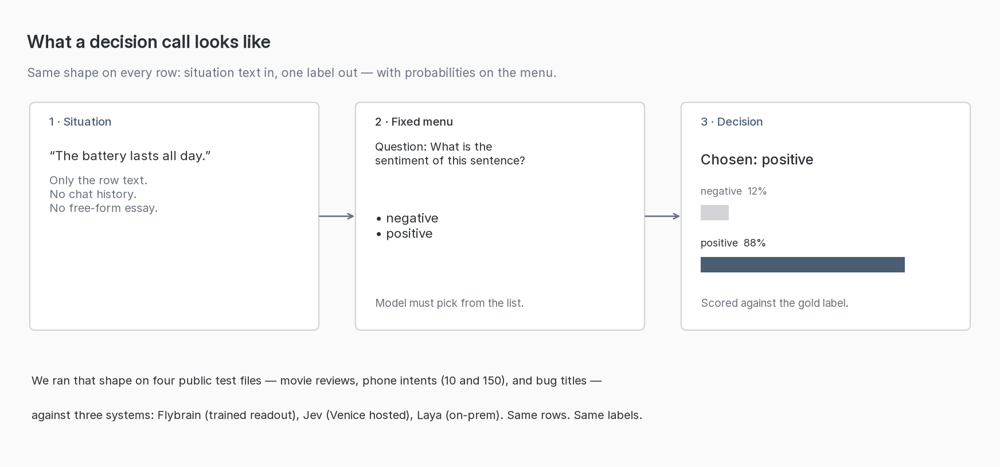
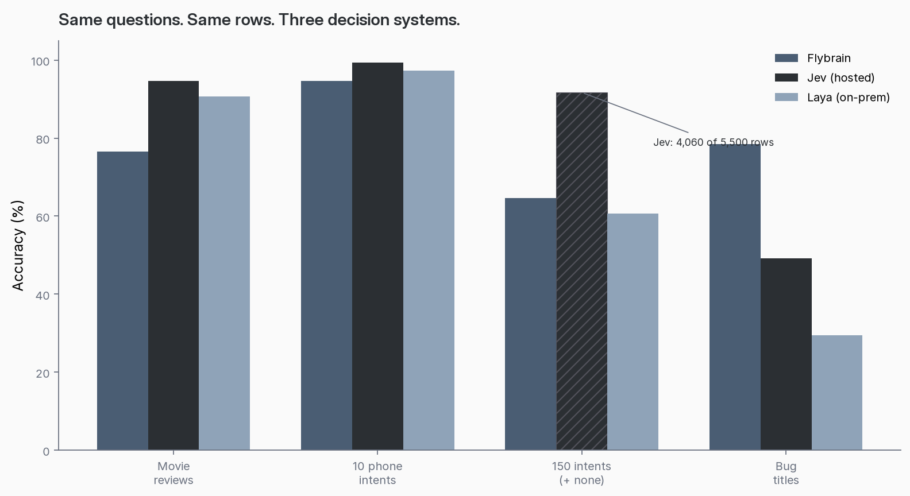
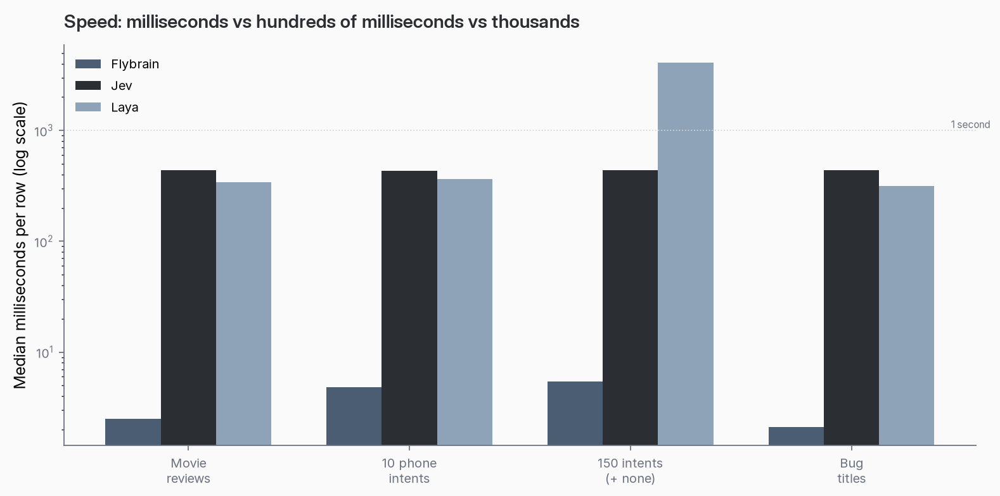
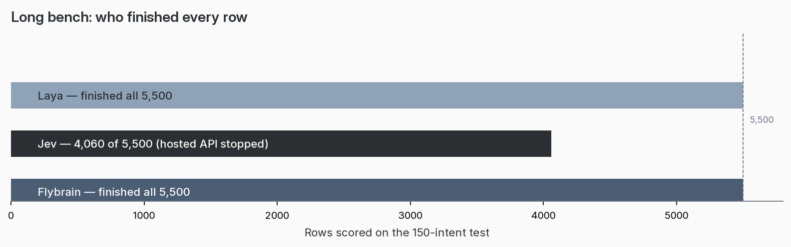

# Same questions, three decision systems

**Flybrain · Jev · Laya** — accuracy, sureness, and speed on four frozen public tests.

Sept 2026 · Decision Science Corp

This repository is the **prescription and the runners** for that bakeoff: locked questions, locked test checksums, scoring contract, Jev / Laya arms, and an **in-repo Flybrain** arm (larva connectome + ridge head). Jump to [Reproduce](#reproduce) when you want to re-run.

---

Most AI demos still look like chat: you ask something open-ended, you get a paragraph back, and somebody has to turn that paragraph into a choice.

We care about the other shape. Situation text in. Fixed menu of answers. One label out — with probabilities on every option. That is a **decision call**. You can score it. You can time it. You can compare systems without arguing about who wrote the better essay.



We put that shape on four public test files we already use in the lab, and we scored **three** systems on the **same rows**:

| System | What it is |
|---|---|
| **Flybrain** | A small trained readout on a connectome-style network — local, milliseconds per row |
| **Jev** | Venice’s hosted decision model (`jev-latest`) — cloud round trip |
| **Laya** | ConvAI’s on-prem decision model — running on our own box |

Same questions. Same labels. Same KPIs: **accuracy**, **Brier** (how honest the probabilities are — lower is better), and **median milliseconds per row**.

### What we trained (and what we didn’t)

**Jev** — nothing. Venice `jev-latest` as hosted. Same decision API, same choice menus, zero fine-tune on these rows.

**Laya** — nothing. We pulled the public open weights (`convaiinnovations/laya`) and ran them. English checkpoint on the three short benches; multilingual checkpoint with a longer window on the 150-intent menu so the model can actually see all 151 options. No fine-tune on SST-2, CLINC, or bug titles. (We deliberately did **not** use their `typed-decisions` fine-tune — that was trained on a different quiz.)

**Flybrain** — this is the one that gets a training pass, and only a small one. The fruit-fly larva **connectome wiring stays frozen** (we do not train the graph). Each sentence or title becomes GloVe word vectors, gets injected into that recurrent reservoir, and we pool the resulting activity into a feature vector. On each task’s **train** split we fit a **ridge classification head** (a thin linear readout) on those features; leak / steps / radius / inject size / pooling are chosen on the **validation** split with a fixed grid; temperature for the probabilities is also fit on validation. The **test** rows are never used for any of that — they are scored once at the end. So when you read “Flybrain saw the training split,” that means: trained a small head on the same public train files Jev and Laya never saw. It does **not** mean we retrained a transformer.

**TL;DR:** We did **not** rebuild or rewire the fly brain. We kept that map fixed. We turned each sentence into numbers, ran those numbers through the map, and taught a tiny “which answer from the menu?” layer on practice examples — then checked it on held-out test rows it had never practiced on. Think sticky note on a locked engine, not a new engine.

### What next-token training already showed (plain language)

On a separate job — **guess the next word in a line** — we *do* train the connectome’s weights, not just a readout. The score there is “how surprised is the model by the real next word?” Lower surprise is better. We always line that score up against dumb lookup tables: a **bigram floor** (guess from the last one word) and a **trigram floor** (guess from the last two). Those floors are not rival products; they are rulers. If you cannot beat “look at the last word,” your fancy wiring is not earning its keep yet. If you beat bigram and close in on trigram, the body is learning something real about the text.

In those labs the trained fly **cleared the bigram floor** and got **close to the trigram floor** — still improving when we stopped — and we **did not** push the run past those lab caps to finish the climb. So we have evidence that weight training on this body moves the needle on a hard language job; we do **not** have a finished “beat trigram” certificate, because we left performance on the table when the epoch limit hit.

### Why that matters for *these* decision scores

This Jev / Laya comparison only used the light recipe: frozen wiring plus a thin classification head. That is a much smaller training ask than the next-word weight-training loop above. The places Flybrain trails Jev on accuracy are therefore **not** a proven ceiling for the fly — they are the ceiling of *this* recipe. Given that the same body already improved under real weight training on next-token prediction, the obvious unpaid experiment is to point that heavier training at these decision tasks (sentiment, intents, bug severity) and re-score the same frozen test files. We have not run that yet. The bet — tech-literate, not trainer-insider — is simple: if training the body helped on “what word comes next,” it is reasonable to expect more headroom on “pick the right label from this menu” than a ridge head alone has shown.

---

## The headline numbers



| Test | Rows | Flybrain | Jev | Laya |
|---|---:|---:|---:|---:|
| Movie-review sentences | 872 | **76.5%** | **94.6%** | **90.6%** |
| Ten phone intents | 300 | **94.7%** | **99.3%** | **97.3%** |
| 150 intents + “none of these” | 5,500† | **64.6%** | **91.7%**† | **60.6%** |
| Eclipse bug titles (severity) | 2,000 | **78.4%** | **49.1%** | **29.5%** |

† Jev’s 150-intent accuracy is on the **4,060 rows it completed** before the hosted API stopped answering. Laya and Flybrain finished all 5,500.

**What jumps out if you are skimming:**

- On short English tasks — sentiment and a ten-intent phone menu — **hosted Jev leads**, and **on-prem Laya is close behind**. Both clear 90%+.
- On the **hard menu** (151 options including “none of these”), Jev’s partial pass is still in the low 90s. Laya and Flybrain land in the 60s — the menu itself is the stress.
- On **bug titles**, where the title is a weak hint and “normal” is a common shrug, **Flybrain is highest of the three**. That is the task where a tiny trained readout beats both large decision models cold.
- Jev’s metered spend for the whole A/B: about **$0.48**.

---

## Speed is not a footnote



Median time per row, same unit everywhere (**milliseconds**):

| Test | Flybrain | Jev | Laya |
|---|---:|---:|---:|
| Movie reviews | 2.5 | 436 | 340 |
| Ten intents | 4.8 | 434 | 365 |
| 150 intents | 5.4 | 435 | **4,063** |
| Bug titles | 2.1 | 438 | 314 |

Flybrain is roughly **100× faster** per row on the short benches (~2–5 ms vs ~340–440 ms) — small frozen network, not a large transformer call. Jev sits near **435 ms** every time (hosted round trip). Laya is in that same band on short menus, then jumps to **~4,000 ms** once the label list is 151 options long — about **six hours** of wall time to finish the full 5,500.

---

## Who finished the long bench



This is the ops half of the story, and it belongs next to accuracy:

- **Laya** and **Flybrain** scored every one of the 5,500 rows.
- **Jev** stopped at **4,060** when the hosted API stopped answering — mid-bench, not mid-design.

If you are deciding where a decision loop lives for a multi-hour pass, **finishability is a KPI**. On-prem does not inherit someone else’s daily ceiling.

---

## What we actually asked

Four tests. Public data. One decision object per row — situation text only, then a fixed choice list.

### 1. Movie-review sentences (SST-2) — 872 rows

Stanford Sentiment Treebank snippets from GLUE. Label is negative or positive.

> What is the sentiment of this sentence?

Allowed answers: **negative**, **positive**.

### 2. Ten everyday phone requests — 300 rows

CLINC utterances, ten intents only (alarm, calculator, date, definition, measurement conversion, spelling, time, timer, translate, weather). Thirty each. No “none of these” rows.

> Which of these intents does the utterance express?

### 3. One hundred fifty intents + “none of these” — 5,500 rows

Full CLINC test split: 150 in-scope intents × 30, plus 1,000 out-of-scope. Last choice is `oos`.

Same question as above — now with **151** options. Laya uses the multilingual checkpoint with a long enough window to actually read the list. Jev gets the same 151-entry object in one request.

### 4. Eclipse bug titles — 2,000 rows

MSR 2013 Eclipse defect titles only (no description). Severities folded to **low / normal / high**.

> How severe is this bug, judging from the title alone?

Titles are often thin. Accuracy alone can look fine if a model parks on “normal.” That is why **Brier** sits next to accuracy in the full table below.

---

## Full scorecard (accuracy · Brier · speed)

Brier is the sureness penalty: squared distance from a perfect “1 on the right answer, 0 on the others,” averaged over rows. **0** is perfect. Lower is better.

| Test | Rows | Flybrain acc | Flybrain Brier | Flybrain median s | Jev acc | Jev Brier | Jev median s | Laya acc | Laya Brier | Laya median s |
|---|---:|---:|---:|---:|---:|---:|---:|---:|---:|---:|
| Movie-review sentences | 872 | 0.765 | 0.324 | 0.0025 | 0.946 | 0.087 | 0.436 | 0.906 | 0.145 | 0.340 |
| Ten everyday requests | 300 | 0.947 | 0.165 | 0.0048 | 0.993 | 0.011 | 0.434 | 0.973 | 0.034 | 0.365 |
| 150 requests + none of these | 5500 (Jev 4060) | 0.646 | 0.954 | 0.0054 | 0.917 (partial) | 0.133 | 0.435 | 0.606 | 0.621 | 4.063 |
| Eclipse bug titles | 2000 | 0.784 | 0.364 | 0.0021 | 0.491 | 0.697 | 0.438 | 0.295 | 0.691 | 0.314 |

Jev input-token spend across the scored rows: about **$0.483** at the published `$0.042 / 1M` input rate (output priced at zero).

### Wall-clock (this week’s Jev / Laya passes)

| Test | Laya | Jev |
|---|---|---|
| Movie reviews (872) | ~5–6 min | ~40 min |
| Ten intents (300) | ~2 min | ~5 min |
| Bug titles (2,000) | ~10 min | ~33 min |
| 150 intents | **~6 h 13 min** (all 5,500) | **~1 h 24 min** (stopped at 4,060) |

Flybrain’s scored pass ran earlier the same week on the same frozen files; per-row times are in the table (~2–5 ms).

---

## Decision matrix — how I’d pick after this scoreboard

I’m not crowning a winner. I’m picking a modality for a constraint. After living this bakeoff, here’s the matrix I’d actually use:

| If this is the constraint… | I’d reach for… | Because the benches said… |
|---|---|---|
| Peak accuracy on short, clean menus (sentiment, ~10 intents) and a cloud round trip is fine | **Hosted decision API (Jev)** — Laya if you want almost-that accuracy on your own box | Jev 94.6% / 99.3%; Laya 90.6% / 97.3%; tightest Brier on Jev |
| Weak-signal labels where “normal” is an easy shrug — and you *have* a train split | **Flybrain-style trained readout** on a fixed body | Bug titles: Flybrain 78.4% vs Jev 49.1% / Laya 29.5% (both cold) |
| Milliseconds / high QPS on hardware you own | **Flybrain** | ~2–5 ms vs ~435 ms hosted — ~100× on a $350 CPU laptop |
| Multi-hour / multi-thousand-row pass that *must* finish without someone else’s API | **On-prem** (Laya or Flybrain) | 5,500 finished locally; hosted Jev stopped at 4,060 mid-bench |
| Huge menus (100+ options) without blowing the context window | **Hosted Jev** when it stays up; Laya only with the long-window checkpoint | 151-option menu is the stress; English 512-token Laya can’t hold it; long-window Laya finishes but ~4 s/row |
| Cheap one-shot evaluation — no new box to buy | **Toss-up.** Jev if you want the hosted frontier with a card; Flybrain or Laya if you’ve got idle hardware in the closet (we did this on a $350 CPU laptop) | Jev arm ~$0.48 API; Laya/Flybrain = power + time you already own. Tech shops usually have the second option sitting around |

Chat isn’t in this matrix. We didn’t score chat. Decision-shaped calls only.

Flybrain’s win conditions assume you can train that sticky-note head. No train split, no bug-title upset.

## Close

Same questions. Three systems. A real fly connectome on a discount laptop, an open-weight decision model on the same box, and the hosted decision model everyone is posting about.

If my loop has to finish overnight on hardware I control, I’m not putting the long pass on a hosted API after this run. If I need peak accuracy on a short menu and I’m fine paying for the round trip, I reach for Jev. If I’ve got labels and I need milliseconds — or a weak-signal job where cold giants shrug — I reach for the fly readout.

That’s what these benches told me. Not a religion. A pick list.

---

## What Jev, Laya, and Flybrain are

For readers who have not been living inside this thread:

**Jev** is Venice AI’s hosted **decision** model — not a chat bot. You send a situation plus a fixed menu of allowed answers; it returns a chosen label and probabilities. In this writeup we call `jev-latest` over Venice’s public decisions API. No local weights on our side; we pay for tokens and wait on their servers.

**Laya** is ConvAI Innovations’ open-weight **decision** model in the same shape (situation in, choice out). We ran the published checkpoints on our own machine — English for the short benches, multilingual with a longer context window when the menu had 151 options. Same idea as Jev, different vendor, on-prem instead of hosted.

**Flybrain** is ours. The recurrent graph is not a transformer we invented from scratch: it is the **published fruit-fly larval brain connectome** — the synaptic wiring map of a *Drosophila* larva (Winding et al., *Science* 2023; the public map people mean when they talk about “the fly connectome”). We inject text as activity into that frozen biological wiring, then read out a decision. That is the “fly” in Flybrain / Fly Cast: real mapped neurons and synapses as the dynamical body, not a metaphor.

---

## Appendix — exact decision objects

Situation text is the row’s text field and nothing else. Byte-for-byte payloads live under `questions/` (clinc150 is built from that split’s `labels.json`).

**Movie reviews**

```json
{"sentiment":{"type":"choice","instructions":"What is the sentiment of this sentence?","criteria":{"negative":"The sentence expresses negative sentiment.","positive":"The sentence expresses positive sentiment."}}}
```

**Ten intents**

```json
{"intent":{"type":"choice","instructions":"Which of these intents does the utterance express?","criteria":{"alarm":"alarm","calculator":"calculator","date":"date","definition":"definition","measurement_conversion":"measurement_conversion","spelling":"spelling","time":"time","timer":"timer","translate":"translate","weather":"weather"}}}
```

**150 intents + oos** — same instruction shape; criteria keys are the 150 intent names from that split’s `labels.json`, alphabetical, then `oos`.

**Bug titles**

```json
{"severity":{"type":"choice","instructions":"How severe is this bug, judging from the title alone?","criteria":{"low":"trivial or minor","normal":"normal","high":"major, critical, or blocker"}}}
```

### Models

| Arm | Call | Where |
|---|---|---|
| Jev | `POST https://api.venice.ai/api/v1/decisions`, model `jev-latest` | Venice |
| Laya (short benches) | `laya.load("convaiinnovations/laya")` — English, 512-token context | On-prem, CPU |
| Laya (150 intents) | Multilingual checkpoint, `max_len=4096`, `head_max_len=2048` | Same install |
| Flybrain | `scripts/run_flybrain.py` — frozen larva graph + ridge head (`configs/flybrain_best.json`) | On-prem, CPU |

### Local hardware (Flybrain + Laya)

Everything we ran on-prem — Flybrain scoring and Laya inference — ran on one box: a **Lenovo IdeaPad Slim 3 15IAN8** (model `82XB`). Street story: about a **$350** Lenovo on discount. Not a rack GPU node.

| Spec | What it is |
|---|---|
| CPU | Intel Core **i3-N305** — 8 cores, up to ~3.8 GHz |
| Memory | **8 GB** RAM (~7 Gi visible to the OS) |
| Storage | **256 GB** NVMe SSD (Samsung) |
| GPU | **None** used — CPU only (no NVIDIA card in this machine) |
| OS | Ubuntu 26.04 |

Jev did not run here; that arm was Venice’s hosted API. The millisecond Flybrain times and the multi-hour Laya 150-intent pass are both measured on this laptop.

### Frozen test files (sha256)

| Task | Rows | sha256 |
|---|---:|---|
| sst2 | 872 | `c5d4733f9738b084e064836d98a27c7ddedc9bd3d8571a39fffb2d30eedd4005` |
| clinc10 | 300 | `a229dfd59e5254930cc1053af12057ea00b5ce306666dac002562c759deb97fe` |
| clinc150 | 5500 | `a29710b72717f17a2514df8e9a5dfc5b37dbeb5ca1ee22f2b25fbd4a17918441` |
| bugsev | 2000 | `6715545ae7b01661bc1ff3bfafff476098061aedbd98832aeacf2972b9c023a6` |

Same hashes are the gate in `lockfile.json` / `scripts/verify_data.py`. Charts: `docs/illustrations/`. Protocol detail: `docs/PROTOCOL.md`. Flybrain arm: `docs/FLYBRAIN.md`.

---

## Reproduce

| Rule | Meaning |
|---|---|
| Same rows | Four frozen `test.tsv` files; sha256 in `lockfile.json` |
| Same questions | Fixed choice objects under `questions/` (clinc150 built from `labels.json`) |
| Same KPIs | Accuracy, Brier, median seconds, finishability (`n_scored / n_planned`) |
| Cold vs sticky-note | Jev and Laya: **no** task training. Flybrain: ridge head on **train** only; connectome wiring frozen |

```bash
python3 -m venv .venv && source .venv/bin/activate
pip install -e .

# 1) Point at frozen data (rebuild: docs/FETCH_DATA.md)
export BAKEOFF_DATA=~/fly-cast-runs/jevlab/data   # example path

# 2) Refuse to proceed if checksums drift
python scripts/verify_data.py --data "$BAKEOFF_DATA"

# 3a) Jev arm (needs Venice key)
export VENICE_JEV_AB_API_KEY=…   # or VENICE_API_KEY
python scripts/run_arm.py --data "$BAKEOFF_DATA" --out runs/jev --task sst2 --arm jev

# 3b) Laya arm (needs `pip install laya` / ConvAI package)
python scripts/run_arm.py --data "$BAKEOFF_DATA" --out runs/laya --task sst2 --arm laya

# 3c) Flybrain (once: python scripts/fetch_glove.py --dir vectors)
python scripts/run_flybrain.py \
  --data "$BAKEOFF_DATA" \
  --glove vectors/glove.6B.100d.txt \
  --out runs/flybrain \
  --task sst2

# 4) Merge summaries
python scripts/make_report.py --runs runs --out runs/report.json
```

### Smoke (no locked corpora)

```bash
python scripts/run_arm.py \
  --data fixtures/smoke --out runs/smoke --task sst2 --arm jev \
  --limit 2 --skip-verify

python scripts/run_flybrain.py \
  --data fixtures/smoke --glove fixtures/smoke/glove.mini.txt \
  --out runs/smoke-fly --task sst2 --limit 4 --skip-verify
```

### Layout

| Path | Role |
|---|---|
| `lockfile.json` | Bakeoff id, arm definitions, per-task row counts + **test sha256** |
| `configs/flybrain_best.json` | Locked Flybrain hyperparameters per task |
| `questions/` | Frozen decision objects |
| `src/decision_bakeoff/flybrain/` | Connectome + reservoir + ridge arm |
| `docs/illustrations/` | Charts used in this README |
| `scripts/run_arm.py` | Jev / Laya |
| `scripts/run_flybrain.py` | Flybrain |
| `docs/PROTOCOL.md` | Human protocol |
| `docs/PREDICTION_SCHEMA.md` | JSONL row schema |
| `docs/FLYBRAIN.md` | Flybrain arm details |
| `docs/FETCH_DATA.md` | Rebuild frozen corpora |
| `docs/PUBLISHED_RESULTS.md` | Compact scoreboard mirror |
| `LICENSING.md` | AGPL code · CC-BY-SA docs · third-party notices |

### Honesty clauses (do not strip)

- Jev and Laya are **cold** in this protocol.
- Flybrain trains a **thin readout** on the public train split; the connectome graph stays frozen.
- clinc150 Jev may stop early if the hosted API dies — report `n_scored` / `n_planned` (finishability).
- Matching the numbers above is optional. Matching **lockfile hashes + question objects** is mandatory for a valid comparison.

### License

**Code:** AGPL-3.0-or-later. **Documentation and other non-code:** CC-BY-SA-4.0. Pointer: `LICENSE`; detail: `LICENSING.md`; full texts: `licenses/`. Larva connectome CSVs remain upstream **CC-BY** (Winding et al.). Benchmark datasets retain their upstream licences (see lockfile + `docs/FETCH_DATA.md`).
